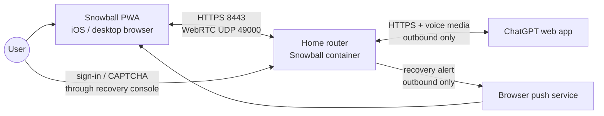
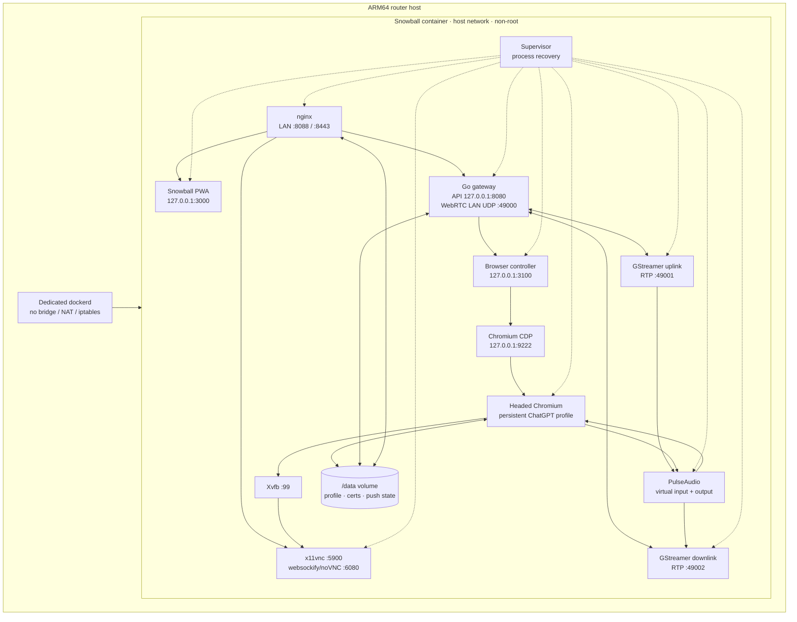
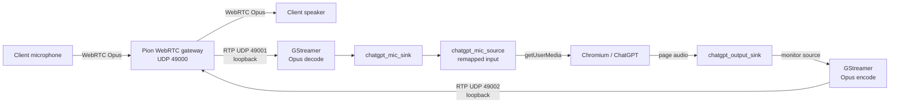
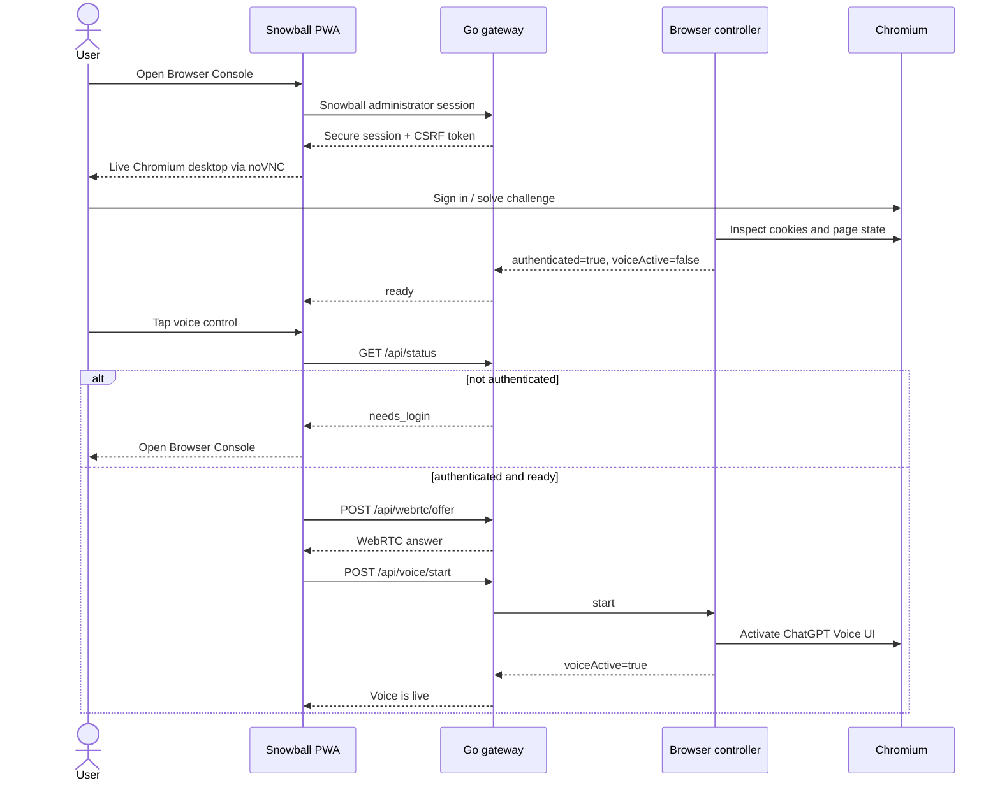
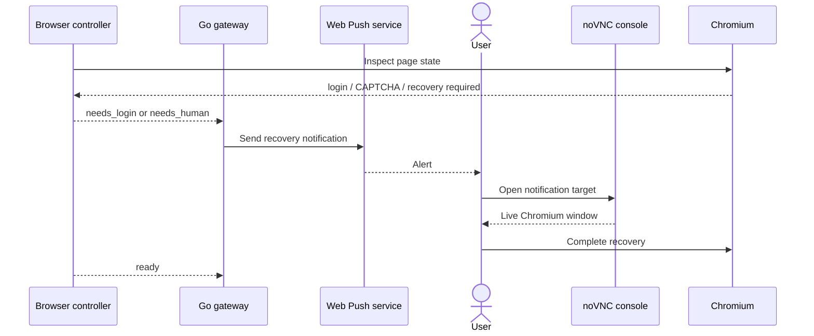
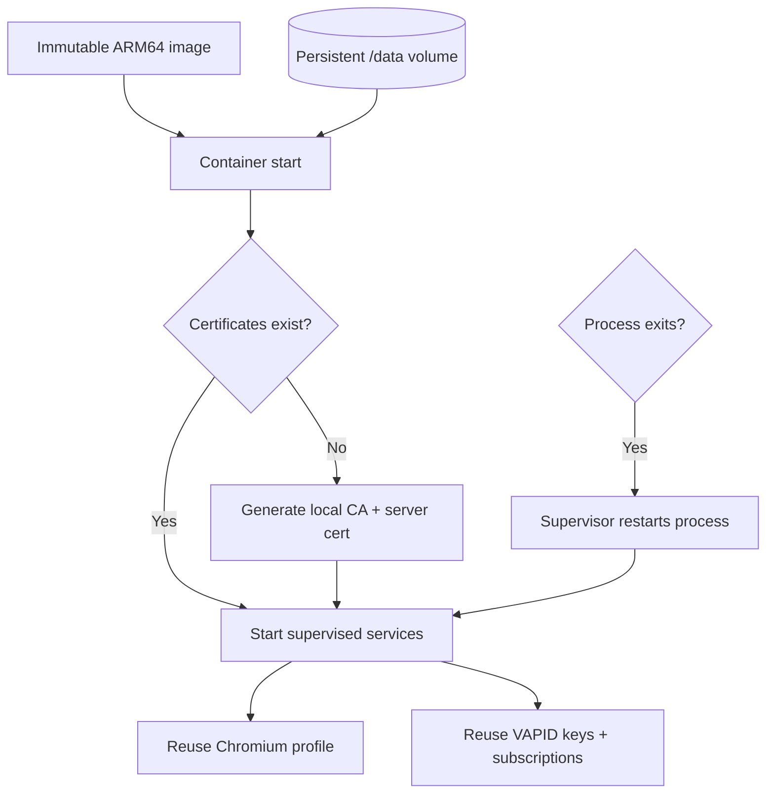

# Snowball Architecture

Snowball is a single-host, LAN-only gateway between a client browser and a persistent ChatGPT Voice session. The design favors an inspectable real browser, explicit network bindings, and recoverable failure modes over invisible browser automation.

## System context

There is no inbound WAN service. Snowball listens on one configured private IPv4 address and relies on the router's existing firewall for the LAN trust boundary. Outbound access is still required for ChatGPT, identity-provider login, and Web Push delivery.

## Container topology

Supervisor owns every long-running process. If Chromium is closed, it is restarted with the same `/data/chromium` profile and the controller reconnects to its loopback-only DevTools endpoint.

## Voice media path

Snowball keeps control traffic on HTTPS and carries audio as Opus over WebRTC. The two media directions are intentionally symmetric but use separate PulseAudio virtual devices.

Chromium policy pre-authorizes audio capture only for `https://chatgpt.com` and its HTTPS subdomains. PulseAudio exposes the WebRTC uplink as a named remapped source because Chromium does not reliably surface a monitor device as a microphone.

## Authentication and voice activation

Authentication is a human recovery workflow, not a voice-start side effect.

Snowball administrator authentication is an additional, separate boundary. On first start the Gateway writes a one-time setup code to protected state and the container log. The user exchanges it for an administrator password; the password is stored as a salted adaptive hash. Voice, WebRTC, Push, settings, and Browser Console access then require a Secure/HttpOnly/SameSite session. State-changing API calls also require a session-bound CSRF token and a same-origin request.

The controller considers the session authenticated only when a ChatGPT session cookie exists. A visible voice-shaped control on a signed-out page is not sufficient. Consequently, a voice-start request from a fresh profile is rejected instead of being queued across login.

## Human recovery and notifications

Push subscriptions and VAPID keys live under `/data/state`. Notifications are advisory: the recovery console remains reachable directly on the LAN even if the external push service is unavailable.

## Network and trust boundaries

| Binding | Process | Exposure |
| --- | --- | --- |
| `${SNOWBALL_LAN_IP}:8088/tcp` | nginx | LAN CA download and redirect |
| `${SNOWBALL_LAN_IP}:8443/tcp` | nginx | LAN HTTPS UI, API, and console |
| `${SNOWBALL_LAN_IP}:49000/udp` | Go gateway | LAN WebRTC ICE/media |
| `127.0.0.1:3000/tcp` | web app | Container/host loopback only |
| `127.0.0.1:3100/tcp` | browser controller | Loopback only |
| `127.0.0.1:5900/tcp` | x11vnc | Loopback only |
| `127.0.0.1:6080/tcp` | websockify/noVNC | Loopback only; proxied by nginx |
| `127.0.0.1:8080/tcp` | Go gateway API | Loopback only; proxied by nginx |
| `127.0.0.1:9222/tcp` | Chromium CDP | Loopback only |
| `127.0.0.1:49001/udp` | GStreamer uplink | Loopback RTP |
| `127.0.0.1:49002/udp` | GStreamer downlink | Loopback RTP |

Defense-in-depth controls include:

- explicit private-IPv4 validation before the WebRTC listener starts
- explicit LAN and loopback binds despite host networking
- a dedicated Docker daemon with bridge, forwarding, masquerade, and Docker iptables management disabled
- read-only root filesystem, tmpfs runtime directories, dropped Linux capabilities, `no-new-privileges`, and a non-root UID
- TLS from a device-local CA for secure-context browser features
- a loopback-only CDP endpoint and a Chromium audio-capture allowlist
- persistent secrets and browser credentials only in the Docker volume
- first-run administrator bootstrap, rate-limited login, in-memory sessions, and an authenticated noVNC proxy
- origin and CSRF checks for every state-changing control request
- schema-driven validation and atomic private writes for editable settings

The headed Chromium process currently requires `--no-sandbox` in this container. The container restrictions and router firewall are therefore essential boundaries rather than optional hardening.

## Persistence and lifecycle

The image is replaceable; `/data` is not. Upgrades must preserve the existing named volume to retain the ChatGPT session, certificates, and notification registrations.

## Design constraints and trade-offs

- **LAN first:** no STUN or TURN keeps the v1 network model small, but prevents remote use without a separate trusted network overlay.
- **Real browser:** a headed browser makes OAuth, CAPTCHA, and UI recovery possible, but introduces an unstable dependency on ChatGPT's DOM and browser requirements.
- **Local TLS:** a private CA enables microphone and service-worker features without a public hostname, at the cost of per-device certificate enrollment.
- **Host networking:** it avoids Docker bridge and router-policy interference, but demands strict explicit binding and makes the host firewall part of the design.
- **Persistent web session:** it avoids storing an OpenAI password in application code, but makes the Chromium volume highly sensitive.
- **Separate local authentication:** ChatGPT cookies stay origin-bound inside Chromium and never become Gateway credentials. This adds one Snowball login but prevents any LAN client from inheriting browser-control authority.
- **Wake input is client-specific:** command parsing and browser execution live in the Gateway, while an ESP32 must detect the wake phrase locally. Browser speech services are not silently used because they can leave the LAN.

See [Wake commands and project turn mode](docs/WAKE_COMMANDS.md) and [Client discovery and pairing security](docs/CLIENT_DISCOVERY_SECURITY.md) for the command contract, capability boundaries, first-power user stories, and future device trust model.

## Source map

- `gateway/main.go` — WebRTC, RTP forwarding, browser control proxy, status, and Web Push
- `services/browser-controller.mjs` — ChatGPT state inspection and voice UI control
- `app/voice-console.tsx` — client microphone, WebRTC lifecycle, status, console, and notifications
- `container/pulse/default.pa` — virtual microphone and output devices
- `container/start-gst-*.sh` — RTP/audio conversion pipelines
- `container/nginx.conf.template` — the LAN-only HTTPS edge
- `container/supervisord.conf` — process lifecycle and recovery
- `runtime/daemon.json` — isolated Docker daemon behavior
