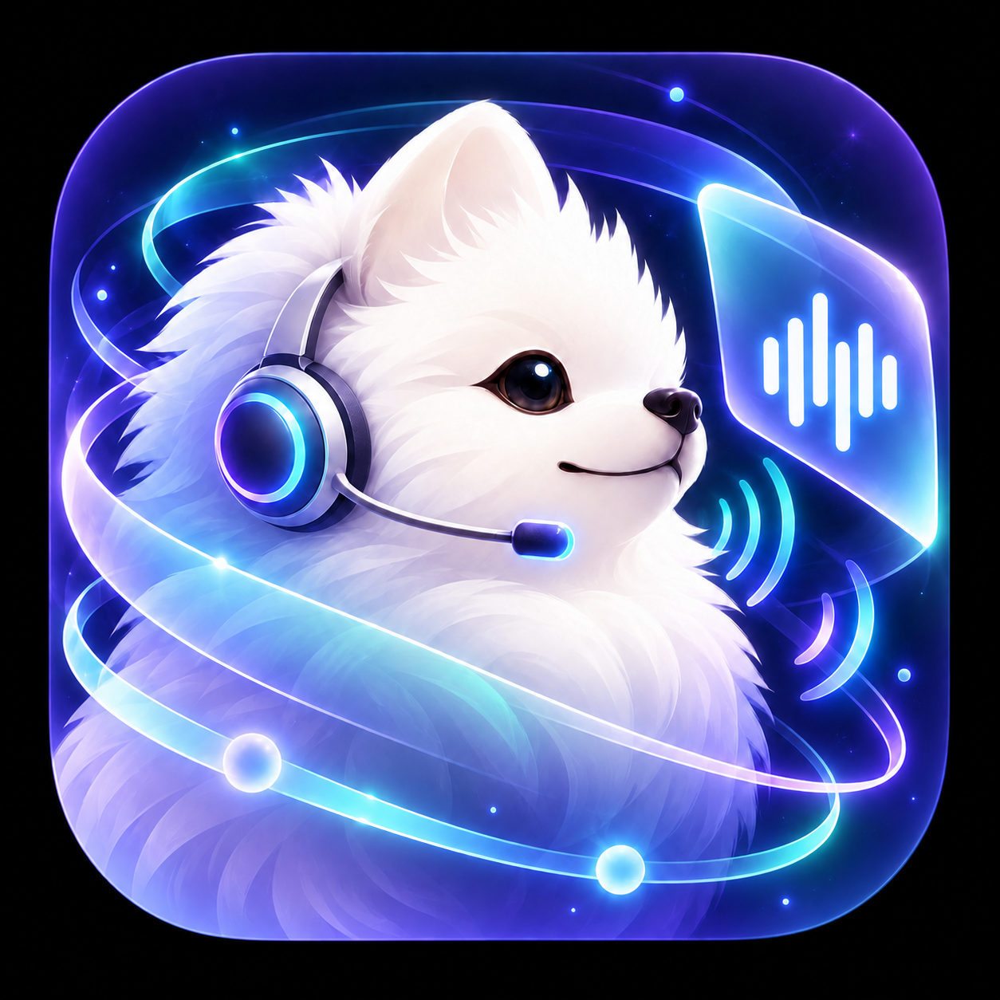
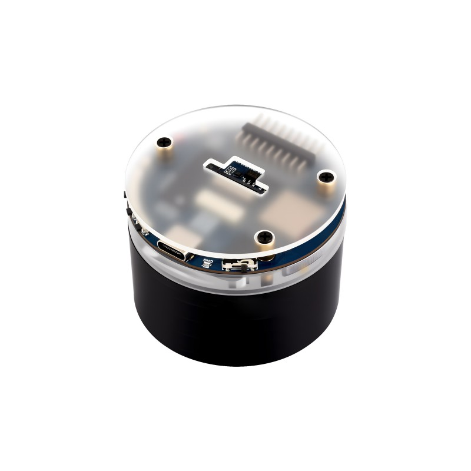
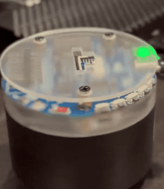

<p align="center"></p>
<h1 align="center">Snowball-Voice · Snowball-Voice-Gate</h1>
<p align="center">A little speaker. A voice companion. Your own LAN Gateway.</p>
<p align="center"><a href="https://github.com/fkiller/snowball/releases/tag/v0.4.0-alpha.1">Download both products</a> · <a href="#web-ui">Web UI</a> · <a href="docs/GETTING_STARTED.md">Buy &amp; build</a> · <a href="docs/PLATFORMS.md">Install your platform</a> · <a href="docs/GETTING_STARTED.md#6-flash-without-erasing-identity">Flash &amp; pair</a></p>

**Snowball-Voice** is the ESP32-S3 speaker client. **Snowball-Voice-Gate** is
the LAN-only Gateway, Web Client, and recovery console for a persistent
ChatGPT web Voice session.

> Experimental developer preview. This unofficial project drives ChatGPT's
> web interface, not a stable API. It is not affiliated with or endorsed by
> OpenAI. Upstream UI/account restrictions can require maintenance.

## Web UI

Snowball-Voice-Gate includes a browser **Voice Web Client** and **Admin** screen.
The Web Client lets you start/stop Voice, open the protected ChatGPT Browser
Console, and view connection/recovery status. Admin provides device pairing,
Gateway status and settings. You can use the Web Client before buying an ESP32.


<details>
<summary>See the active Voice screen</summary>


</details>

These are captures of the actual application from isolated synthetic QA, with
test status/address values; they are not a recording of a live ChatGPT call.

After installing the Gateway and trusting its HTTPS certificate, open
`https://YOUR_GATEWAY_LAN_IP:8443/` for Voice or `/admin` for administration.
The UI runs on your LAN Gateway; this GitHub page provides screenshots and
source. [Web UI tour and access guide](docs/WEB_UI.md) ·
[HTTPS, administrator setup and ChatGPT login](docs/GETTING_STARTED.md#4-set-up-https-and-sign-in).

## Start here

[Buy, install tools, compile, flash, pair, and run](docs/GETTING_STARTED.md).
[Gateway platform-specific releases and setup](docs/PLATFORMS.md).

| Product | Role | Alpha version |
| --- | --- | --- |
| Snowball-Voice-Gate | Linux ARM64/AMD64 container; Windows/macOS use a LAN-connected Linux VM/host | `0.4.0-alpha.1` |
| Snowball-Voice | Waveshare ESP32-S3-AUDIO-Board, 16 MB flash / 8 MB PSRAM | `0.4.0-alpha.1` |
| Device protocol | Pinned HTTPS + PCMA DTLS-SRTP | `1` |

<p align="center">
  
  &nbsp;&nbsp;&nbsp;&nbsp;
  
</p>
<p align="center">
  <em>Left: Supported board (<a href="https://www.waveshare.com/esp32-s3-audio-board.htm">Waveshare ESP32-S3-AUDIO-Board</a>) · Right: Live hardware in operation (<a href="https://x.com/fkiller/status/2088063549369102555">Watch video demo on X</a>)</em>
</p>

Check [Releases](https://github.com/fkiller/snowball/releases) for actually
published tags/assets. CI publishes both products with verified downloads,
Linux image archives, source, licenses, and SBOMs. Existing identifiers stay `snowball-voice`, `/data`, and
`snowball_speaker.bin` so upgrades preserve credentials.

The [0.4.0-alpha.1 release](https://github.com/fkiller/snowball/releases/tag/v0.4.0-alpha.1)
is public. [CI publication and anonymous verification passed](https://github.com/fkiller/snowball/actions/runs/36998111226)
for every download; physical and VM acceptance limits remain documented below.

## What works

- Voice Web Client with explicit microphone/WebRTC start and stop.
- Persistent Chromium and protected Browser Console for manual login/CAPTCHA.
  Opening it never starts Voice.
- Separate administrator authentication, CSRF/origin checks, strict bounded
  JSON, and private state writes.
- ESP32 `Hi ESP` wake model, bounded English command tails, candidate sync,
  and bounded microphone/playback queues.
- Desktop Chrome/Edge Web Serial pairing, pinned CA, P-256 identity,
  one-use enrollment, and replay-protected control/media.
- Prior physical full-duplex transport acceptance: **10m30s** with no drops or
  unexpected resets. [Measured evidence](docs/FULL_DUPLEX_STABILITY.md).

## Fresh Linux Gateway install

Set `SNOWBALL_LAN_IP` in `compose.yaml` to a private IPv4 address actually
assigned to the Linux host, then:

```sh
git clone https://github.com/fkiller/snowball.git
cd snowball
git checkout v0.4.0-alpha.1
sh tools/gate-start.sh download
SNOWBALL_LAN_IP=192.168.1.20 sh tools/gate-start.sh install
sh tools/gate-start.sh status
```

Continue with [HTTPS and administrator/ChatGPT setup](docs/GETTING_STARTED.md#4-set-up-https-and-sign-in).
Existing users follow [upgrade/rollback](docs/OPENWRT.md#upgrade-and-rollback).
`Dockerfile.update` depends on an old local base and is not a first-install path.

## Boundaries and known limits

Only the configured private LAN IPv4 exposes TCP **8088**, TCP **8443**, and
UDP **49000**. CDP, VNC, internal APIs, and RTP stay loopback-only. No WAN
forwarding, STUN/TURN, or cloud relay. ChatGPT/optional Web Push require
outbound Internet; conversation audio goes to ChatGPT. [Privacy](docs/PRIVACY.md).

The ESP32 firmware is for development: AEC is disabled, NVS is plaintext,
and production Secure Boot, flash encryption, signed OTA, and anti-rollback
are incomplete. The wake phrase is **Hi ESP**. Ordinary acoustic cycles,
barge-in, and broader product acceptance remain open. Chromium currently uses
`--no-sandbox` inside a constrained non-root container; keep the LAN boundary.

Visible ChatGPT Web Projects support bounded turn-based automation. Codex
local projects return a capability error until a paired desktop adapter exists.
USB setup requires desktop Chrome/Edge; phones can use the Web Client.

## Documentation

| Document | Purpose |
| --- | --- |
| [Getting started](docs/GETTING_STARTED.md) | Purchase → tools → compile → flash → pair → run |
| [Platforms](docs/PLATFORMS.md) | Linux ARM64/AMD64, Windows, macOS, OpenWrt packages/setup |
| [Web UI](docs/WEB_UI.md) | Screen previews, Voice Web Client, Admin and how to open them |
| [Architecture](ARCHITECTURE.md) | Components, media, persistence, trust boundaries |
| [Firmware](firmware/esp32-s3-audio/README.md) | ESP32 implementation and USB protocol |
| [Pairing acceptance](docs/PAIRING_ACCEPTANCE.md) | Board, registry, proof, runtime gates |
| [Wake commands](docs/WAKE_COMMANDS.md) | Command tails and project behavior |
| [Test scenarios](docs/TEST_SCENARIOS.md) | Physical/browser acceptance |
| [OpenWrt operations](docs/OPENWRT.md) | Optional boot/migration and upgrade/rollback |
| [Release plan](docs/RELEASE_PLAN.md) / [readiness](docs/RELEASE_READINESS.md) | Assets, gates, and actual results |
| [Security](SECURITY.md) / [Contributing](CONTRIBUTING.md) | Private reports and development checks |

## License

Project-authored Gateway and ESP32 source is **MIT**: [LICENSE](LICENSE).
Espressif components/models retain Espressif-only conditions. Combined
firmware and container images include other licenses and are not exclusively
MIT. Read [THIRD_PARTY_NOTICES.md](THIRD_PARTY_NOTICES.md) before redistribution.
Third-party trademarks are not licensed by the project.
