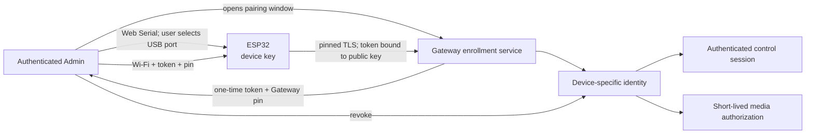

# Client discovery and USB pairing security

This document defines the user story and trust model for the Web Client and the
Waveshare ESP32-S3-AUDIO-Board client. Snowball remains LAN-only.

## Product decisions

- The Web Client is zero-config because it is loaded from its own Gateway
  origin.
- Initial ESP32 setup uses **USB-C + Web Serial only**. BLE and a temporary
  SoftAP are not alternate product paths.
- Web Serial runs in the administrator's desktop Chrome or Edge process. The
  Snowball container and Docker host do not need access to the USB device.
- Discovery identifies a Gateway; it never grants control. Each paired ESP32
  receives its own revocable identity and never receives the administrator
  password or ChatGPT browser credentials.

Web Serial requires a secure context and a user gesture. The administrator must
first trust Snowball's private CA and open the HTTPS Admin page in a supported
desktop Chromium browser. Safari and Firefox are not setup-browser targets.

## Web Client user story

1. The user opens the Snowball HTTPS origin and trusts the device-local CA once.
2. Snowball requires initial administrator setup or login before exposing
   status, Voice, settings, pairing, or Browser Console control.
3. The same-origin PWA does not discover a Gateway; its origin already
   identifies it.
4. A Secure/HttpOnly/SameSite session cookie authenticates requests and a
   per-session CSRF token protects writes.
5. ChatGPT sign-in remains a separate action inside the protected Browser
   Console.

ChatGPT login cannot double as local Gateway authentication. ChatGPT cookies
are origin-bound and HttpOnly, are not an OAuth credential for Snowball, and
must stay inside the persistent Chromium profile.

## ESP32 first-power user story

1. The administrator plugs the speaker's USB-C port into any Windows, macOS, or
   Linux computer and opens Snowball Admin in desktop Chrome or Edge.
2. Admin opens an explicit, short-lived pairing window and the user clicks
   **Connect USB device**. The browser's native chooser is the physical-presence
   confirmation. Snowball filters for Espressif USB Serial/JTAG devices when
   possible, but the user still chooses the exact port.
3. Admin opens the selected port through `navigator.serial`. The device returns
   only its model, firmware/protocol versions, hardware identifier, generated
   public key, and public-key fingerprint.
4. Admin requests a one-time enrollment token from the authenticated Gateway.
   Wi-Fi SSID/passphrase are entered in the page but sent directly from browser
   memory to the ESP32 over USB; the Gateway does not store them.
5. The browser sends the Wi-Fi configuration, private Gateway address, Gateway
   certificate pin, one-time enrollment token, and expiry over USB Serial.
6. The ESP32 validates all bounds, stores pending configuration in encrypted
   NVS when flash encryption is enabled, joins Wi-Fi, and accepts only the
   pinned Gateway identity.
7. The ESP32 binds the one-time token to its public key and exchanges it for a
   device-specific client identity. The Gateway records device name, public-key
   fingerprint, firmware version, creation time, last-seen time, and revocation
   state.
8. On success, both sides erase the enrollment token and transient Wi-Fi secret
   buffers. Admin shows the paired device only after it cross-checks the same
   hardware ID and public-key fingerprint in the Gateway registry with state
   `active`. The USB cable may then be removed.

No secret is echoed in a USB response or written to browser, Gateway, firmware,
or Docker logs. Failed or interrupted provisioning remains pending and does not
open an unauthenticated LAN service. Reopening setup requires USB physical
access or an authenticated Admin reset action.

The four mandatory completion gates and the current physical-device state are
defined in [Speaker pairing acceptance plan](PAIRING_ACCEPTANCE.md).

## USB Serial protocol boundary

Provisioning uses bounded newline-delimited JSON with protocol version `1`.
Each request has a random request ID and one operation. Responses repeat only
the request ID, success state, and a non-sensitive result or stable error code.

Initial operations are:

| Operation | Direction | Purpose |
| --- | --- | --- |
| `hello` | browser → device | Negotiate protocol and obtain non-secret device identity |
| `provision` | browser → device | Deliver Wi-Fi and one-time Gateway enrollment material |
| `status` | browser → device | Read a redacted provisioning/connection state |
| `factory-reset` | browser → device | Erase device configuration after an explicit Admin confirmation |

The device rejects unknown fields, duplicate keys, invalid UTF-8, lines over the
configured limit, unsupported protocol versions, expired tokens, non-private
Gateway addresses, and malformed certificate pins. A provisioning response
must never include the Wi-Fi passphrase or enrollment token.

Web Serial is only the initial setup transport. It is not a permanent control
backdoor, and the browser page never forwards raw serial access into the
Gateway container.

## Discovery after Wi-Fi

After enrollment, the ESP32 resolves the Gateway in this order:

1. Cached private address plus pinned Gateway certificate identity.
2. Authenticated Admin-provided replacement address.
3. A future `_snowball._tcp.local` mDNS record containing protocol/version
   hints only.

The device authenticates before starting control or media. A discovery answer
never contains credentials and cannot create a session. Adding mDNS or any UDP
fallback changes the router listener surface and requires a firewall and threat
model review first.

## Device authorization model



Required controls:

- Pairing window closed by default, explicitly opened, rate-limited, and
  expiring.
- One-use enrollment token bound to one public key and a short expiry.
- Per-device identity, certificate pinning, revocation, and replay protection.
- Strict bounded USB and HTTP messages with unknown-field rejection.
- One active media session by default and an explicit takeover policy.
- Admin-visible revoke, rotate, update, and factory-reset workflows.
- Signed production firmware, anti-rollback, Secure Boot, and flash encryption
  before treating a device as production-trusted. Development flashing must not
  burn eFuses.

## Docker and network boundaries

Docker is not part of the USB data path:

```text
ESP32 USB-C ↔ desktop Chrome/Edge Web Serial
                         │
                         └── HTTPS over LAN ↔ Snowball Gateway in Docker
```

This works whether Snowball Docker runs on the same computer or another LAN
machine. It avoids Docker Desktop USB passthrough differences and prevents the
container from needing a broad `/dev` mapping or host Bluetooth privileges.

The current production surface remains TCP 8088/8443 and UDP 49000 on the
private LAN address. No client work may expose CDP, VNC, RTP, PulseAudio,
internal controller ports, or a new inbound WAN listener.
