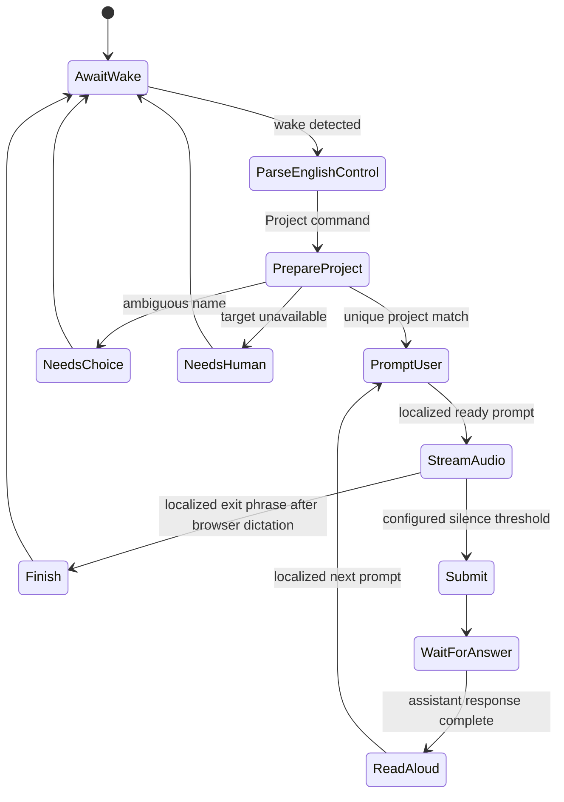

# Wake commands and project turn mode

Snowball deliberately separates local control recognition from free-form
dictation.

- The ESP32 recognizes a wake model and a small **English-only** command
  grammar.
- The Gateway validates the structured command, resolves spoken names against
  authoritative browser/project candidates, and controls the browser adapter.
  After enrollment the board also sends a signed candidate-sync event; the
  bounded catalog is persisted in NVS and consumed when the optional command
  grammar is rebuilt on the next boot.
- Once dictation or a project turn begins, the ESP32 streams microphone audio.
  It does not transcribe Korean or any other message language.
- ChatGPT/Codex dictation produces the message text. **Read aloud** produces the
  response audio returned to the ESP32.

This keeps Korean STT/TTS and large language models off the router and ESP32.

## Wake mode and command roadmap

The development firmware starts with Espressif's `Hi ESP` WakeNet model. The
production target is the editable `ChatGPT` wake phrase after a suitable custom
model is trained and validated.

The current development image runs MultiNet immediately after **Hi ESP** with
an 1.8-second bare-wake timeout. A bare wake therefore still opens a new
authenticated full-duplex ChatGPT Voice session, while a one-phrase command is
resolved without an artificial pause. Wake detection and the command tail
remain separate protocol fields, so changing the wake model will not change
Gateway intent parsing. The command grammar is rebuilt from the last
authenticated catalog rather than production names embedded in the image.

Control words and voice/project names are English/Latin-script inputs by
product convention:

| Spoken command | Intent | Target |
| --- | --- | --- |
| `Hi ESP` | Start a new conversation | ChatGPT |
| `Hi ESP Resume` | Continue the current conversation | ChatGPT |
| `Hi ESP with Cove` | Start a new conversation and request the named voice | ChatGPT |
| `Hi ESP Project Snowball` | Start turn-based project mode | ChatGPT Project `Snowball` |
| `Hi ESP Codex Project Snowball` | Start turn-based project mode | Codex Project `Snowball` |

With the later wake model, only `Hi ESP` changes to `ChatGPT`.

`Codex Project` is tested before plain `Project`. If ChatGPT and Codex both
contain the same name, `Project Snowball` selects ChatGPT and the explicit
`Codex Project Snowball` form selects Codex.

## Spoken-name resolution

Speech recognition is not expected to produce exact spelling for every English
project or voice name. The ESP32 sends its recognized name slot and confidence;
it never invents the final identifier.

The Gateway resolves that slot against the actual names supplied by the target
adapter:

1. Unicode/case, whitespace, punctuation, and hyphen normalization.
2. Exact normalized match and configured alias match.
3. Token/edit and phonetic similarity with a bounded acceptance threshold.
4. Reject or ask for confirmation when the best candidate is weak or too close
   to the runner-up.

Browser automation receives only the exact selected name. A client-provided
candidate list is never authoritative.

## Turn-based project state machine



The ready, next, unavailable, and exit resources live in
`gateway/resources/default-settings.json`, are copied to protected persistent
settings, and are editable through Admin. Prompt language controls what the
user hears and which exit phrases browser dictation accepts; it does not change
the ESP32 control grammar.

Silence/VAD is measured by the audio capture adapter. It ends one audio turn; it
does not require a Korean transcript on the ESP32.

## Control and media contract

The device sends structured control events rather than a guessed combined
transcript:

```json
{
  "version": 1,
  "wake": "hi_esp",
  "command": "project",
  "target": "chatgpt",
  "name": "snow ball",
  "confidence": 0.82,
  "counter": 41
}
```

An authenticated session and strictly increasing counter bind the event to one
paired device. Gateway settings remain authoritative for whether wake commands
are enabled and for prompt/turn timing.

For new/resumed full-duplex Voice, media uses the normal Snowball WebRTC path.
For project/dictation mode, the device first establishes the authenticated
PCMA media peer, then streams captured audio while the browser adapter owns
the narrow ChatGPT dictation control. The adapter stops on the configured
silence threshold or maximum utterance duration, submits the captured text,
waits for the answer, and invokes Read aloud over the same downlink. The
Gateway keeps the board media lifecycle separate from browser DOM operations;
an explicit stop tears down both and clears the pending project receipt.

The current authenticated Web Client command tester may still submit a full
`ChatGPT ...` transcript for diagnostics. That compatibility input is not the
ESP32 wire contract.

## Adapter capabilities and limits

- ChatGPT Web Projects: the Chromium controller may select only a uniquely
  resolved visible project, speak the localized prompt, capture one turn with
  the separate dictation control, submit through a recognized composer, wait
  for the assistant turn, and click an exact Read aloud control. Changed,
  ambiguous, or missing browser capabilities stop with a structured recovery
  error rather than clicking full Voice by accident.
- Codex local projects: the router Chromium adapter cannot attach desktop
  folders. A paired desktop-host adapter is required; until then Snowball must
  return an explicit capability error.
- Voice selection: attempted only through a recognized Voice settings control
  and a uniquely resolved visible voice name.
- ESP32: wake, fixed English control recognition, microphone capture, local
  VAD/silence, transport, and speaker playback only.

The Gateway/browser status remains authoritative for ChatGPT Voice state. A
WebRTC connection or device wake event alone must never display “Voice is
live.”
