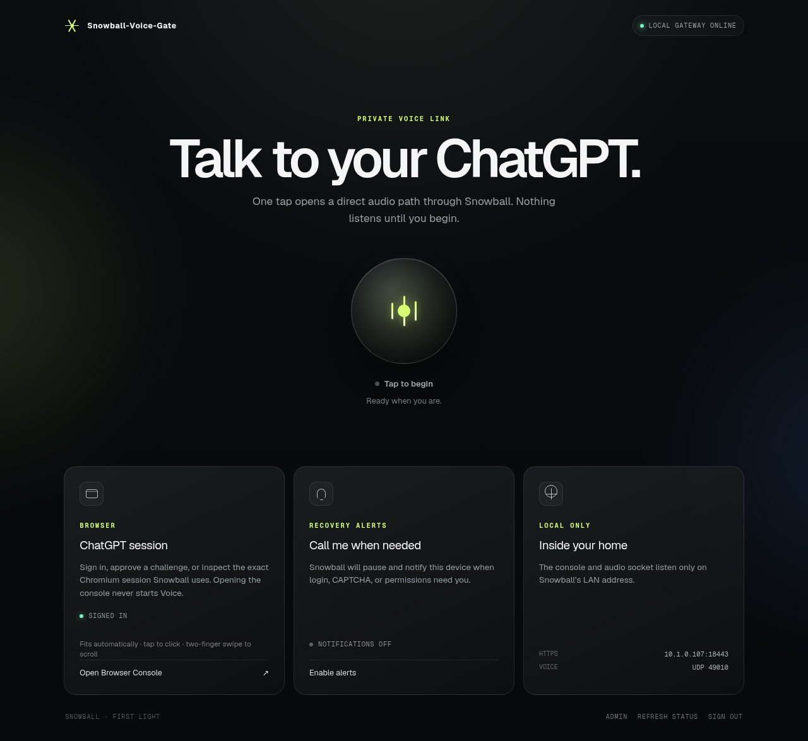
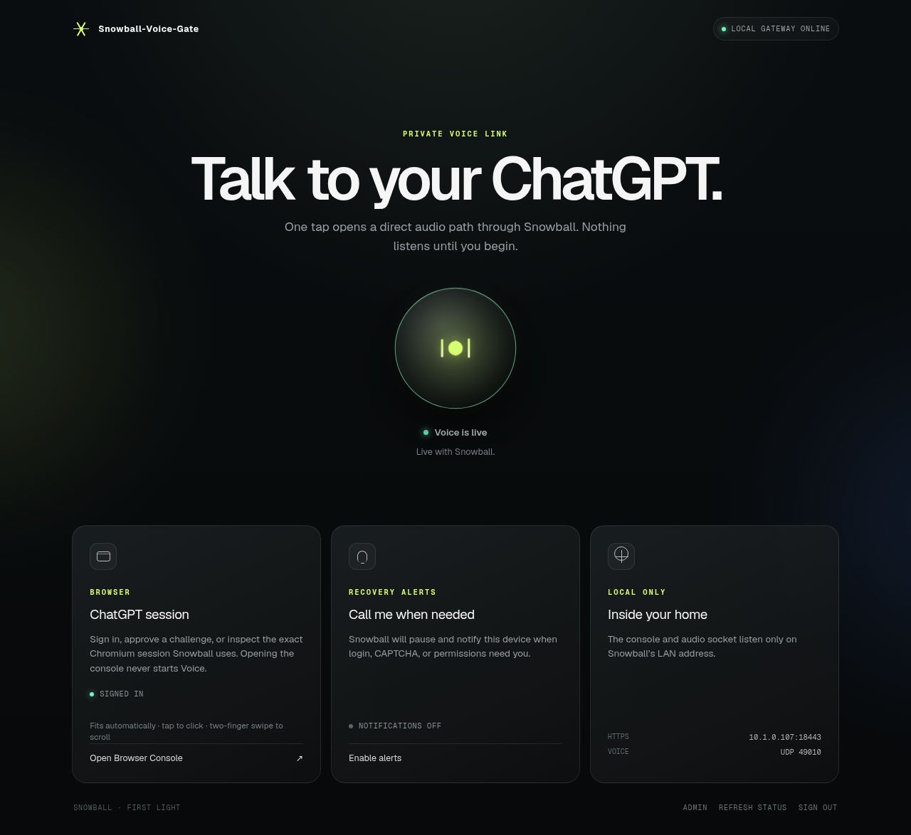

# Snowball-Voice-Gate Web UI

The Gateway includes a Voice Web Client at `/` and an administrator screen at
`/admin`. They ship in the Gateway image; no separate Web UI download is needed.
The Web Client can be used without an ESP32 speaker.

## Voice Web Client

- The central control explicitly starts/stops Voice. Nothing listens before
  you begin; your browser asks for microphone permission when needed.
- The ChatGPT session card opens the protected Browser Console for login,
  CAPTCHA or account recovery. Opening that console never starts Voice.
- Recovery alerts and connection status show when attention is needed.
- The Admin link opens the separate administrator screen.

The active appearance follows authoritative Gateway/browser Voice state;
a connected WebRTC transport alone is insufficient to display “Voice is live.”

## Open the UI after installation

1. Follow [your platform's Gateway installation](PLATFORMS.md). Windows/macOS
   launchers run the Gateway on a reachable LAN Linux VM/host.
2. Follow [HTTPS certificate trust and initial setup](GETTING_STARTED.md#4-set-up-https-and-sign-in).
3. Replace the example with the private IPv4 assigned to your Gateway host:

   | Screen | Example URL |
   | --- | --- |
   | Voice Web Client | `https://192.168.1.20:8443/` |
   | Admin | `https://192.168.1.20:8443/admin` |

4. Sign in with your Snowball administrator account. Use the protected Browser
   Console to sign into ChatGPT separately, then return to the Web Client.
5. Start Voice, grant microphone permission, verify active status, speak and
   listen. Stop Voice explicitly when finished. See
   [first-conversation verification](GETTING_STARTED.md#8-verify-the-first-conversation).

Use a supported browser and trusted HTTPS for microphone access. USB device
pairing requires desktop Chrome/Edge with Web Serial. The Web Client also
serves phone browsers that support its media features; USB pairing stays on
the setup computer. This repository does not host a public running Gateway.

## Admin and device pairing

Admin provides Gateway/browser status, versioned settings and device-management
controls. To connect Snowball-Voice, follow
[USB pairing, then Wi-Fi](GETTING_STARTED.md#7-pair-over-usb-then-use-wi-fi).
The Snowball administrator account and ChatGPT account are separate; signing
in or opening the Browser Console does not automatically start a conversation.

## Screenshot provenance

These PNGs are unmodified captures of the actual `0.4.0-alpha.1` frontend from
the isolated [browser QA run](https://github.com/fkiller/snowball/actions/runs/36963388762),
produced by [the browser smoke test](../tests/browser-smoke.mjs). Ready and
active screenshots use synthetic browser/media state and disposable test
addresses/ports. They contain no production profile, password, session cookie,
device key or real conversation. Screenshot status is illustrative; fresh
physical and platform acceptance remains tracked in [release readiness](RELEASE_READINESS.md).
